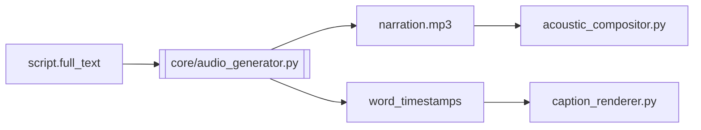

# Example: edge-tts in audio_generator

Reference output quality for the `explain-pipeline-feature` skill.

---

# Audio Generator: edge-tts word-level timestamps

## One-sentence summary

Converts the narration script into an MP3 file and a list of per-word start/end times so captions can sync to speech.

## Where it sits in the pipeline

- **Stage:** Production
- **Module:** `core/audio_generator.py`
- **Upstream:** `orchestrator_mvp.py` passes `script["full_text"]`
- **Downstream:** `caption_renderer.py` matches `layout_tokens` to `word_timestamps`; final mux uses the MP3 path

## The problem it solves

Short-form retention depends on kinetic captions timed to the spoken word. Without millisecond boundaries, text layers would be guessed or evenly spaced — visibly out of sync.

## Under the hood (step by step)

1. `synthesize_speech()` wraps an async call via `asyncio.run()`.
2. `edge_tts.Communicate(text, voice)` opens a streaming synthesis session.
3. The async iterator yields chunks of type `"audio"` (raw MP3 bytes) or `"WordBoundary"`.
4. Audio bytes append to `output/narration.mp3`.
5. Each `WordBoundary` chunk carries `text`, `offset`, and `duration` in **100-nanosecond units**.
6. `_word_boundary_to_ms()` converts to `start_ms` / `end_ms` integers.
7. Returns the full `word_timestamps` list to the orchestrator for the payload.

## Data contract

| Field | Type | Meaning |
|-------|------|---------|
| `text` | string | Spoken token from TTS engine |
| `start_ms` | int | Word start in milliseconds |
| `end_ms` | int | Word end in milliseconds |

Example output entry:

```json
{ "text": "Hello", "start_ms": 0, "end_ms": 342 }
```

## New technology: edge-tts

- **What it is:** Python wrapper for Microsoft Edge's online neural TTS (free, no API key).
- **Why we chose it here:** Fast MVP, good quality, exposes word boundaries in the stream.
- **How we use it:** `Communicate.stream()` with chunk type filtering; default voice `en-US-AriaNeural`.
- **Alternatives considered:** ElevenLabs (paid, richer voices), OpenAI TTS (no native word boundaries in all modes), Coqui XTTS (local, heavier setup).

## Pipeline diagram (this component highlighted)



## Integration points

- **Env vars:** none required for edge-tts (network access only)
- **Config files:** voice could move to config later
- **Hard dependencies:** `edge-tts`, `asyncio`, network connectivity

## Failure modes & debugging

| Symptom | Likely cause | Where to look |
|---------|--------------|---------------|
| Empty MP3 | Network blocked or invalid voice | Retry; list voices via edge-tts CLI |
| Missing timestamps | Stream didn't emit WordBoundary | Text too short; edge-tts version |
| Caption mismatch | Token text ≠ timestamp text | AGENT 2 layout vs spoken words |

## Decoupling check

- [x] Swappable if replacement emits MP3 + same timestamp schema
- [x] Output schema stable for caption_renderer
- [x] No secrets hardcoded

## What to read next

- `core/audio_generator.py`
- `orchestrator_mvp.py` (lines wiring `synthesize_speech`)
- `docs/architecture/ai-shorts-engine-spec.md`
