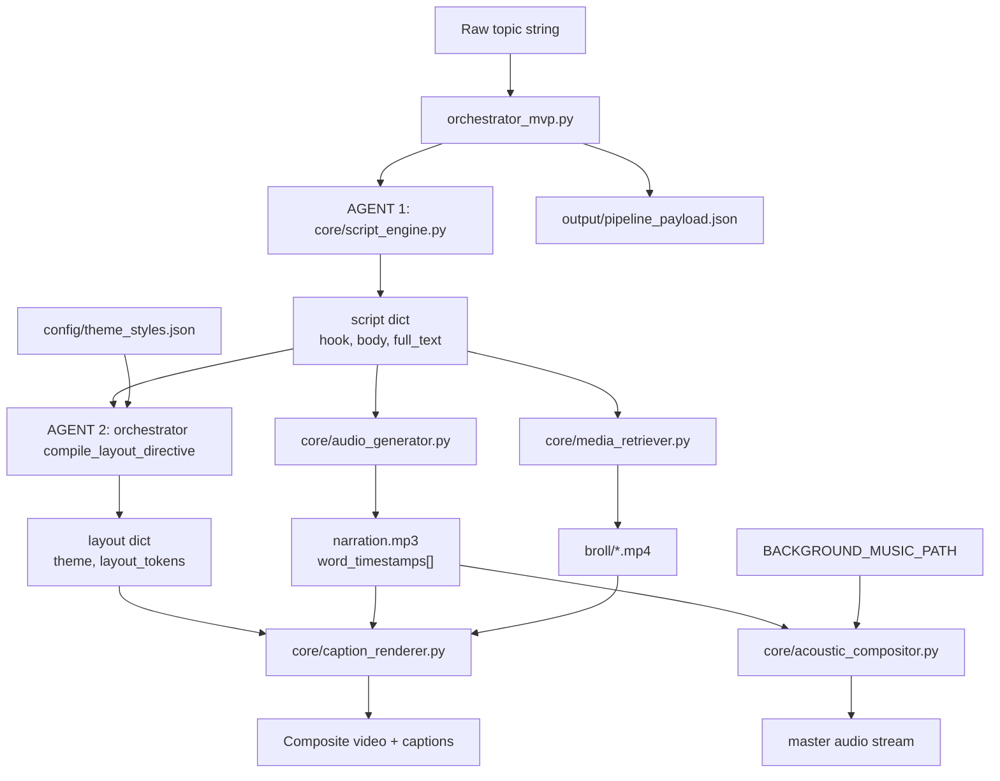
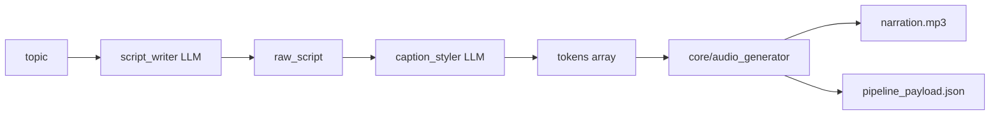

# Pipeline map — Short-form content generator

Canonical module graph for `explain-pipeline-feature`. Update this file when modules or handoff schemas change.

## End-to-end flow



## Module responsibilities

| Module | Role | Primary tech |
|--------|------|--------------|
| `orchestrator_mvp.py` | Master controller; dual-LLM sequence; payload assembly | OpenAI |
| `core/script_engine.py` | AGENT 1 — hook + body copy | OpenAI |
| `core/audio_generator.py` | TTS + word-level ms timestamps | edge-tts |
| `core/media_retriever.py` | Keyword extract + stock b-roll download | requests, Pexels API |
| `core/caption_renderer.py` | Styled timed text layers on video | MoviePy, theme_styles.json |
| `core/acoustic_compositor.py` | Voice + ambient music mix | MoviePy |
| `config/theme_styles.json` | Global design dictionary | JSON |

## Orchestrator payload schema (`pipeline_payload.json`)

```json
{
  "topic": "string",
  "script": {
    "hook": "string",
    "body": "string",
    "full_text": "string"
  },
  "layout": {
    "theme": "minimalist | cyberpunk",
    "layout_tokens": [
      {
        "text": "string",
        "style": "primary | highlight",
        "animation": "none | pop"
      }
    ]
  },
  "audio": {
    "path": "output/narration.mp3",
    "word_timestamps": [
      { "text": "word", "start_ms": 0, "end_ms": 120 }
    ]
  },
  "media": {
    "broll_dir": "output/broll",
    "music_path": "optional path or null"
  },
  "render": {
    "output_dir": "output",
    "theme": "minimalist"
  }
}
```

## Decoupling rules (from architecture spec)

1. **Schema-driven handoffs** — modules exchange explicit dicts/files, not shared mutable state.
2. **No hardcoded credentials** — use env vars (`OPENAI_API_KEY`, `PEXELS_API_KEY`, etc.).
3. **Swappable engines** — replace TTS, LLM, or stock provider inside one module without refactoring others, as long as output schema stays stable.
4. **Orchestrator coordinates; core executes** — business logic lives in `core/`, sequencing in `orchestrator_mvp.py`.

## MVP phase (complete — 2026-07-03)

The live entrypoint is [`orchestrator_mvp.py`](../../orchestrator_mvp.py). **MVP scope is done:** script writer → caption styler → TTS → payload JSON. Render modules are the next phase.



**MVP payload schema** (written to `output/pipeline_payload.json`):

```json
{
  "topic": "string",
  "raw_script": "string",
  "tokens": [
    {
      "word": "string",
      "highlight_color": "string",
      "animation_pop": "string"
    }
  ],
  "audio": {
    "path": "output/narration.mp3",
    "voice": "vi-VN-HoaiMyNeural",
    "word_timestamps": [
      { "text": "word", "start_ms": 0, "end_ms": 120 }
    ]
  }
}
```

Render modules (`caption_renderer`, `media_retriever`, `acoustic_compositor`) consume this payload in a later phase.

## Current wiring status (MVP)

| Step | Wired in orchestrator? |
|------|------------------------|
| Script writer LLM | Yes |
| Caption styler LLM | Yes |
| edge-tts audio | Yes |
| Payload JSON write | Yes |
| Pexels b-roll | No (module exists; call from render stage) |
| Caption render | No (module exists; consumes payload) |
| Acoustic mix | No (module exists; consumes audio + music path) |
| Final video export | Not yet |

## Environment variables

| Variable | Used by |
|----------|---------|
| `OPENAI_API_KEY` | orchestrator LLM calls |
| `OPENAI_BASE_URL` | Gemini OpenAI-compatible endpoint |
| `SCRIPT_WRITER_MODEL` | orchestrator script writer |
| `CAPTION_STYLER_MODEL` | orchestrator caption styler |
| `TTS_VOICE` | orchestrator → audio_generator |
| `OUTPUT_DIR` | default for `--output-dir` |
| `OPENAI_TIMEOUT` | LLM client timeout (seconds) |
| `PEXELS_API_KEY` | media_retriever |
| `BACKGROUND_MUSIC_PATH` | acoustic_compositor (future payload field) |

## Component isolation test commands

```bash
# Full orchestrator (needs OPENAI_API_KEY)
python orchestrator_mvp.py "your topic"

# Individual modules — import and call from a REPL or small script
python -c "from core.audio_generator import synthesize_speech; print(synthesize_speech('Hello world', 'output/test.mp3'))"
```

When explaining a new feature, state which of these stages it affects and whether the payload schema must change.
