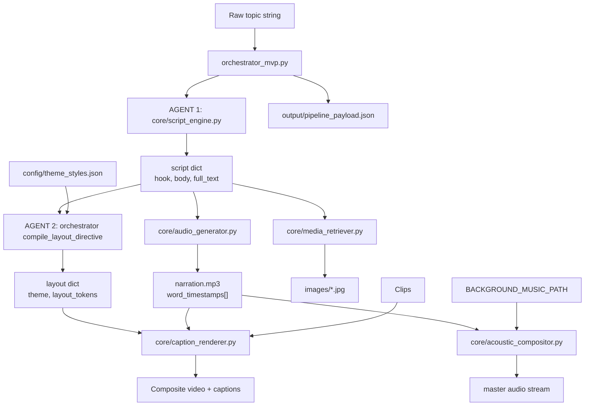
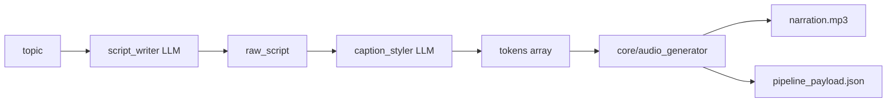

# Pipeline map — Short-form content generator

Canonical module graph for `explain-pipeline-feature`. Update this file when modules or handoff schemas change.

## End-to-end flow



## Module responsibilities

| Module | Role | Primary tech |
|--------|------|--------------|
| `orchestrator_mvp.py` | Master controller; dual-LLM sequence; payload assembly | OpenAI |
| `core/script_engine.py` | AGENT 1 — hook + body copy | OpenAI |
| `core/audio_generator.py` | TTS + word-level ms timestamps | edge-tts |
| `core/media_retriever.py` | Keyword extract + stock image download (video clips deferred) | requests, Pexels API |
| `core/caption_render_stage.py` | CLI alias → Remotion render | `remotion_render_stage` |
| `core/remotion_render_stage.py` | Project JSON → Remotion props + CLI | Remotion, `theme_styles.json` |
| `core/caption_renderer.py` | Legacy MoviePy caption layers (reference) | MoviePy |
| `core/acoustic_compositor.py` | Voice + ambient music mix | MoviePy |
| `config/theme_styles.json` | Global design dictionary | JSON |

## Orchestrator payload schema (`pipeline_payload.json`)

```json
{
  "topic": "string",
  "script": {
    "hook": "string",
    "body": "string",
    "full_text": "string"
  },
  "layout": {
    "theme": "minimalist | cyberpunk",
    "layout_tokens": [
      {
        "text": "string",
        "style": "primary | highlight",
        "animation": "none | pop"
      }
    ]
  },
  "audio": {
    "path": "output/narration.mp3",
    "word_timestamps": [
      { "text": "word", "start_ms": 0, "end_ms": 120 }
    ]
  },
  "media": {
    "broll_dir": "output/broll",
    "music_path": "optional path or null"
  },
  "render": {
    "output_dir": "output",
    "theme": "minimalist"
  }
}
```

## Decoupling rules (from architecture spec)

1. **Schema-driven handoffs** — modules exchange explicit dicts/files, not shared mutable state.
2. **No hardcoded credentials** — use env vars (`OPENAI_API_KEY`, `PEXELS_API_KEY`, etc.).
3. **Swappable engines** — replace TTS, LLM, or stock provider inside one module without refactoring others, as long as output schema stays stable.
4. **Orchestrator coordinates; core executes** — business logic lives in `core/`, sequencing in `orchestrator_mvp.py`.

## MVP phase (complete — 2026-07-03)

The live entrypoint is [`orchestrator_mvp.py`](../../orchestrator_mvp.py). **MVP scope is done:** script writer → caption styler → TTS → payload JSON. Render modules are the next phase.



**MVP payload schema** (written to `output/pipeline_payload.json`):

```json
{
  "topic": "string",
  "raw_script": "string",
  "tokens": [
    {
      "text": "string",
      "style": "primary | highlight",
      "animation": "none | pop",
      "start_ms": 0,
      "end_ms": 120
    }
  ],
  "audio": {
    "path": "output/narration.mp3",
    "voice": "vi-VN-HoaiMyNeural",
    "word_timestamps": [
      { "text": "word", "start_ms": 0, "end_ms": 120 }
    ]
  }
}
```

Render modules (`caption_renderer`, `media_retriever`, `acoustic_compositor`) consume this payload in a later phase.

## Project schema (Tier 2 editability)

> **ADR:** [0002-project-file-editability.md](../../docs/adr/0002-project-file-editability.md)

Phase 2 evolves `pipeline_payload.json` into **`project.json`** — the file a future UI loads, edits, and re-renders from. `final.mp4` is a derived export, not the source of truth.

```json
{
  "project_version": 1,
  "topic": "string",
  "raw_script": "string",
  "captions": {
    "theme": "minimalist",
    "font": null,
    "tokens": [
      {
        "text": "90%",
        "spoken_text": "90%",
        "style": "highlight",
        "animation": "pop",
        "start_ms": 0,
        "end_ms": 420
      }
    ]
  },
  "audio": {
    "narration": {
      "path": "output/narration.mp3",
      "voice": "vi-VN-HoaiMyNeural",
      "word_timestamps": [
        { "text": "90%", "start_ms": 0, "end_ms": 420 }
      ]
    },
    "music": {
      "path": "assets/music/ambient.mp3",
      "volume": 0.18,
      "ducking_factor": 0.35
    }
  },
  "video": {
    "canvas": { "width": 1080, "height": 1920 },
    "images": [
      {
        "path": "output/images/water_123.jpg",
        "start_ms": 0,
        "end_ms": 8000,
        "source": "pexels",
        "media_type": "image"
      }
    ],
    "clips": []
  },
  "render": {
    "output_dir": "output",
    "preview_path": null,
    "final_path": "output/final.mp4"
  }
}
```

### Editable fields (future UI)

| UI action | Project path | Re-render stage |
|-----------|--------------|-----------------|
| Change caption word on screen | `captions.tokens[].word` | Caption render only |
| Change spoken word (re-voice) | `raw_script` + token `spoken_word` | TTS → mix → caption sync |
| Swap background music | `audio.music.path`, `volume` | Acoustic mix → export |
| Change caption font | `captions.font` (override) or `captions.theme` | Caption render only |
| Trim/reorder background images | `video.images[]` | Video compositor → export |
| Trim/reorder b-roll clips | `video.clips[]` | Video compositor → export (future) |

### Phase 2 implementation rules

1. Orchestrator writes `project.json`; render stages **read** it, never overwrite user-edited fields silently.
2. Merge `start_ms` / `end_ms` into caption tokens at generation time (from `word_timestamps`) so the UI can nudge timing without re-TTS.
3. `captions.font: null` means “use theme default from `theme_styles.json`”; a string overrides for this project only.
4. **Render engine:** [ADR 0003](../../docs/adr/0003-remotion-render-and-editor.md) — Remotion (`remotion/`) is the main renderer. Python bridge: `core/remotion_render_stage.py`.
4. Keep `pipeline_payload.json` as an alias or generation snapshot until UI lands; prefer `project.json` in new code.

## Current wiring status

**Defaults:** `--mode slideshow`, export via Remotion (`remotion_render_stage`).

| Step | Wired in orchestrator? |
|------|------------------------|
| Scene script + TTS writer (slideshow) | Yes (`--mode slideshow`, default) |
| Slide images | Yes (inline in slideshow pipeline) |
| edge-tts audio | Yes |
| Payload JSON write | Yes |
| Remotion render → final MP4 | No (standalone CLI; batch runner in progress) |
| Acoustic mix | No (module exists; optional) |
| Pexels b-roll | Out of scope (removed from Phase 2) |

Legacy: `caption_renderer.py` (MoviePy), `broll_retrieval_stage` (standalone CLI only).

## Environment variables

| Variable | Used by |
|----------|---------|
| `OPENAI_API_KEY` | orchestrator LLM calls |
| `OPENAI_BASE_URL` | Gemini OpenAI-compatible endpoint |
| `SCRIPT_WRITER_MODEL` | orchestrator script writer |
| `CAPTION_STYLER_MODEL` | orchestrator caption styler |
| `TTS_VOICE` | orchestrator → audio_generator |
| `OUTPUT_DIR` | default for `--output-dir` |
| `OPENAI_TIMEOUT` | LLM client timeout (seconds) |
| `PEXELS_API_KEY` | media_retriever |
| `MUSIC_DIR` | `core/music_picker.py` — random background music library |
| `BACKGROUND_MUSIC_PATH` | Legacy; used as music dir if it points to a folder |

## Component isolation test commands

```bash
# Full orchestrator (needs OPENAI_API_KEY)
python orchestrator_mvp.py "your topic"

# Individual modules — import and call from a REPL or small script
python -c "from core.audio_generator import synthesize_speech; print(synthesize_speech('Hello world', 'output/test.mp3'))"

# B-roll retrieval (needs PEXELS_API_KEY and existing pipeline_payload.json)
python -m core.broll_retrieval_stage output/pipeline_payload.json
```

When explaining a new feature, state which of these stages it affects and whether the payload schema must change.

## Next milestone: CSV batch demo

> Detail: [docs/architecture/roadmap.md](../../docs/architecture/roadmap.md)

Planned additions (not implemented):

| Component | Role |
|-----------|------|
| `jobs.csv` | Job queue — topic per row, `status`, `output_path` |
| Batch runner CLI | Read CSV, run `pending` rows through slideshow → Remotion, update CSV |
| Cron / Task Scheduler | Invokes batch runner on a fixed interval |

Optimization and Knowledge systems from the product spec are **deferred** until this demo ships.
