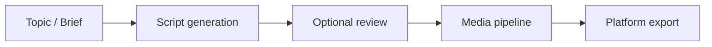
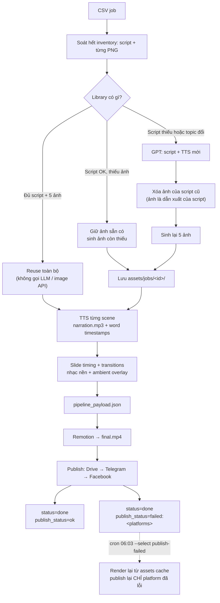

# Architecture overview

> Status: **production pipeline active** — current milestone is a **CSV batch demo + cron** ([roadmap.md](roadmap.md)). Optimization and Knowledge are deferred. Full technical spec: [ai-shorts-engine-spec.md](ai-shorts-engine-spec.md).

## Purpose

Generate short-form video content end-to-end or in stages. Near-term focus is **batch production** from a CSV job file on a schedule. The full product loop (Production → Optimization → Knowledge) is defined in [../domain/content-learning-system.md](../domain/content-learning-system.md) but **not in scope** until the batch demo ships.

- **Input**: topic, brief, brand voice, reference material
- **Generation**: script, hook, captions, metadata (title, hashtags)
- **Production**: voiceover, visuals, timing, subtitles (optional)
- **Output**: platform-ready assets (9:16, safe zones, duration limits)

## Planned modules (initial)

| Module | Responsibility |
|--------|----------------|
| **Core / domain** | Content models, platform constraints, validation |
| **Generation** | LLM prompts, structured output, retries |
| **Media** | Audio/video assembly, ffmpeg or cloud APIs |
| **Pipeline** | Orchestration, job queue, idempotent steps |
| **CLI / API** | Entry points for humans and automation |

## Platform constraints (reference)

| Platform | Aspect ratio | Typical max length |
|----------|--------------|-------------------|
| TikTok | 9:16 | 3 min (short-form often &lt; 60s) |
| Instagram Reels | 9:16 | 90s |
| YouTube Shorts | 9:16 | 60s |

Agents implementing features should verify current platform limits before hard-coding.

## Stack

| Layer | Choice | Notes |
|-------|--------|-------|
| **Generation / orchestration** | Python | `orchestrator_mvp.py`, `core/*` |
| **LLM** | Gemini via OpenAI-compatible SDK | ADR [0001](../adr/0001-gemini-openai-compatible-sdk.md) |
| **TTS** | edge-tts | Word-level timestamps for caption sync; per-scene concat in slideshow mode |
| **Slide images** | ChatGPT (`gpt-image-2`) or Pollinations (free default) | `core/slide_image_stage.py` — `OPENAI_IMAGE_API_KEY`, `OPENAI_IMAGE_PROMPT_MODE` (compact\|full), `OPENAI_IMAGE_QUALITY`; separate from Gemini text LLM |
| **Project state** | `project.json` | ADR [0002](../adr/0002-project-file-editability.md) |
| **Video render** | [Remotion](https://www.remotion.dev/) (`remotion/`) | ADR [0003](../adr/0003-remotion-render-and-editor.md) — captions, b-roll, export |
| **Audio mix** | Remotion | Background music mixed in `ShortVideo` composition |
| **Deployment** | TBD | Local Node SSR first; Lambda optional |

## Data flow (high level)

### Slideshow mode (3-scene)

Batch passes `job_assets_id` (ADR [0008](../adr/0008-job-asset-cache.md)). Entry: `python orchestrator_mvp.py "topic"` (default: slideshow). Prompts: `docs/prompts/`. Image cuts align to `scene_timestamps`; default `caption_mode=none`. Export: `python core/remotion_render_stage.py output/pipeline_payload.json`.

Two invariants the branches above encode:

- **Slide images are derived from the script**, never independent of it. A regenerated script (missing draft, or a `topic` edited in `jobs.csv`) invalidates every PNG, so they are purged rather than reused — role-based filenames (`intro.png`, `scene_1.png`) would otherwise make stale images look like a valid cache to `force=False`.
- **A render that succeeds outlives a publish that fails.** The row stays `done` and the gap is recorded per platform in `publish_status`, so the retry re-publishes only what actually failed instead of duplicating the video on platforms that already have it. See [batch-demo.md](../batch-demo.md).

## Roadmap

- **Current milestone:** [roadmap.md](roadmap.md) — CSV job queue, batch runner, cron
- Task board: [current-tasks.md](../workflow/current-tasks.md)

## Related

- Technical spec: [ai-shorts-engine-spec.md](ai-shorts-engine-spec.md)
- Product spec: [../domain/content-learning-system.md](../domain/content-learning-system.md)
- ADRs: [../adr/README.md](../adr/README.md) (see [0002 project editability](../adr/0002-project-file-editability.md))
- Agent workflow: [../workflow/agentic-workflow.md](../workflow/agentic-workflow.md)
