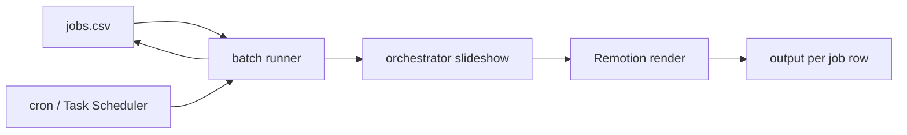

# Roadmap — production pipeline

> **Current milestone:** workable **batch demo** — load jobs from a CSV file and run them on a schedule (cron). Optimization and Knowledge systems are **out of scope** until this demo ships.

## Scope for this milestone

| In scope | Out of scope (deferred) |
|----------|-------------------------|
| Production pipeline end-to-end | Optimization (hypothesis testing, cohort analysis) |
| CSV as job input | Knowledge base / decision log |
| Scheduled batch execution (cron) | Remotion Phase B/C (Player + timeline editor) |
| Per-row status and output paths in CSV | Tier 2 edit UI (`project.json` partial re-render hooks) |
| One-command or thin-wrapper demo flow | GitHub Actions CI (nice-to-have, not blocking demo) |

Full product vision (Production → Optimization → Knowledge) remains in [content-learning-system.md](../domain/content-learning-system.md) for later.

---

## Milestone: CSV batch demo

**Goal:** Drop a CSV of topics, run a scheduler, get MP4s in predictable output folders — no manual CLI per video.

### Target operator flow (not yet implemented)

1. Maintain `jobs.csv` (or path via env) with one row per video.
2. Cron (or Windows Task Scheduler) invokes the batch runner on a fixed interval.
3. Runner picks rows with `status=pending`, runs the pipeline, writes `status=done` or `status=failed` and `output_path`.
4. Operator collects MP4s from `output_path` columns.

### Planned CSV schema (draft)

| Column | Required | Description |
|--------|----------|-------------|
| `id` | yes | Stable row id (string or int) |
| `topic` | yes | Input to script/slideshow pipeline |
| `status` | yes | `pending` \| `running` \| `done` \| `failed` |
| `mode` | no | `slideshow` (default) or `mvp` |
| `image_provider` | no | `chatgpt` \| `pollinations` \| `mock` |
| `output_path` | no | Filled by runner on success |
| `error` | no | Filled by runner on failure |
| `created_at` | no | ISO timestamp |
| `completed_at` | no | ISO timestamp |

Exact columns may change at implementation time; the contract is **CSV as the job queue and status ledger**.

### Demo pipeline path (reuse existing modules)

**Defaults:** `mode=slideshow`, render via **Remotion** (`core/remotion_render_stage.py`). Stitch (`stitch.py`) remains an optional manual path for asset-only experiments — not the default export.

Default row execution chain:

1. `orchestrator_mvp.py --mode slideshow` — script, scenes, TTS, slide images, `pipeline_payload.json`
2. `core/remotion_render_stage.py` — final 9:16 MP4 (`output/final.mp4` or per-job path)

The batch runner should call existing stages; no new render engine for the demo.

### Cron / scheduler (planned)

- **Linux/macOS:** `cron` entry calling e.g. `python batch_runner.py --csv jobs.csv`
- **Windows:** Task Scheduler running the same command on an interval
- Runner must be **idempotent**: safe if cron fires while a previous run is still active (skip or lock `running` rows)

Document the chosen schedule and command in a short `docs/batch-demo.md` when implemented.

---

## Phase 2 — Complete the render pipeline

> **Defaults:** slideshow mode + Remotion export. Optimization, Knowledge, b-roll retrieval (2.2), and TTS hardening (2.6) are **out of scope**.

| # | Item | Status | Notes |
|---|------|--------|-------|
| **2.1** | Caption render (T004) | Done | `caption_render_stage` → `remotion_render_stage`. `caption_renderer.py` is legacy MoviePy reference only. |
| **2.3** | Video assembly | Done | Remotion `ShortVideo` composition — timed slides, captions, 9:16 canvas. No separate MoviePy compositor. |
| **2.4** | Acoustic mix (T005) | Done | Random track from `assets/music/` → `audio.music` in payload → Remotion mix |
| **2.5** | Final video export | Done | `orchestrator_mvp.py` → Remotion → `final.mp4`; `render.final_path` in payload |
| **2.7** | Orchestrator evolution | Done | `run_slideshow_with_render` / `run_mvp_with_render`; batch reuses same chain |
| **2.8** | Tests & CI (T003) | Partial | pytest in place; GitHub Actions deferred post-demo. |

**Removed from Phase 2**

| # | Item | Reason |
|---|------|--------|
| ~~2.2~~ | B-roll / Pexels retrieval | Slideshow uses AI slide images; stock b-roll not on the default path. |
| ~~2.6~~ | TTS hardening | Deferred; edge-tts sufficient for current 3-scene slideshow length. |

**Optional (not default):** `stitch.py` for manual image+audio experiments; `mvp` mode for word-karaoke caption renders.

---

## Phase status (production only)

### Done

| Area | Notes |
|------|-------|
| MVP orchestrator | Script → tokens → TTS → `pipeline_payload.json` |
| Slideshow pipeline | 3-scene mode, per-scene TTS, slide images (default mode) |
| Caption timing | Per-sentence mode via word timestamps |
| Remotion Phase A | Headless render from project/payload JSON (default export) |
| Stitch CLI | Optional manual path — images + audio + effects → MP4 |

### Next (demo milestone)

| ID | Task | Priority | Notes |
|----|------|----------|-------|
| T016 | CSV job schema + batch runner CLI | **High** | Done — `batch_runner.py`, `--max-jobs 1` default |
| T018 | End-to-end demo wiring | **High** | Done — batch row → `run_slideshow_with_render` → MP4 |
| T017 | Cron / scheduled execution | **High** | Done — [batch-demo.md](../batch-demo.md) |

### Deferred (after demo)

| ID | Task | Notes |
|----|------|-------|
| T007 | Project schema + partial re-render hooks | Needed for edit UI, not batch demo |
| T009 | Remotion Phase B — Player preview | Editor track |
| T010 | Remotion Phase C — Timeline editor | Blocked on T009 |
| T003 | GitHub Actions CI | Post-demo hygiene |
| — | Optimization system | See content-learning-system.md |
| — | Knowledge system | See content-learning-system.md |

---

## Success criteria for the demo

- [ ] CSV with ≥3 `pending` rows runs without manual intervention per row
- [ ] Cron (or Task Scheduler) triggers the batch runner on a documented schedule
- [ ] Each successful row has `status=done` and a valid `output_path` MP4
- [ ] Failed rows set `status=failed` and `error` without blocking other rows
- [ ] Re-running the scheduler does not re-process `done` rows

---

## Related

- Task board: [current-tasks.md](../workflow/current-tasks.md)
- Pipeline modules: [pipeline-map.md](../../.cursor/skills/explain-pipeline-feature/pipeline-map.md)
- Stitch path: [stitch-cli.md](../stitch-cli.md)
- Product spec (full loop, later): [content-learning-system.md](../domain/content-learning-system.md)
