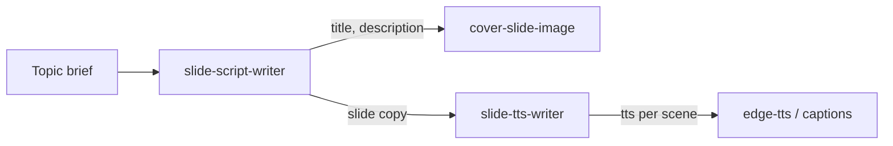

# Cover slide image — Nhân Tướng VN

Prompt for **cover-slide image generation** only. On-image typography is **inspired by** the [Script writer](slide-script-writer.md) output — same theme and message, but wording on the image may differ.

**Inputs (from script writer JSON):** `{{TITLE}}`, `{{DESCRIPTION}}`, optional `{{TOPIC}}` for scene symbolism. Use these as creative briefs, not verbatim copy requirements.

---

## Image generation prompt

```
Create a brand-new premium vertical illustration for a TikTok educational slideshow about Vietnamese Physiognomy (Nhân Tướng Học).

The image is designed for short-form educational content and must instantly capture attention while remaining elegant, luxurious, minimal, and highly readable on a mobile phone.

The artwork should feel like the cover of a premium documentary or a luxury philosophy book rather than a typical social media graphic.

Topic context (for symbolic scene — do not render as literal text):
{{TOPIC}}

--------------------------------------------------
ART DIRECTION
--------------------------------------------------

Create a museum-quality digital painting.

Luxury editorial illustration.

Semi-realistic.

Fine painterly brushwork.

Rich natural texture.

Elegant composition.

Soft cinematic atmosphere.

Premium artwork.

Inspired by luxury editorial design, documentary illustrations, and timeless East Asian philosophy.

DO NOT create:

- Anime
- Cartoon
- Comic
- Manga
- 3D render
- CGI
- Photorealistic image
- Low-detail artwork
- Flat vector illustration

The illustration should look handcrafted by a professional concept artist.

--------------------------------------------------
MOOD
--------------------------------------------------

The atmosphere should communicate:

- Wisdom
- Serenity
- Mystery
- Timeless philosophy
- Quiet confidence
- Elegance
- Spiritual depth without fantasy
- Traditional Vietnamese cultural identity

The viewer should immediately feel:

"This is ancient wisdom worth listening to."

--------------------------------------------------
COLOR PALETTE
--------------------------------------------------

Primary colors:

Warm ivory

Soft cream

Natural parchment

Warm golden sunlight

Muted gold

Earth brown

Dark walnut wood

Deep burgundy (#7b0100)

Subtle charcoal shadows

Avoid:

- Neon colors
- Bright blue
- Pure black
- Oversaturated colors

Overall tone should feel warm, bright, luxurious, and premium.

--------------------------------------------------
LIGHTING
--------------------------------------------------

Golden hour sunlight.

Soft volumetric lighting.

Warm glowing atmosphere.

Gentle morning mist.

Natural sunlight entering from one direction.

Soft realistic shadows.

Background softly faded.

Highest visual contrast should only appear around the typography.

--------------------------------------------------
COMPOSITION
--------------------------------------------------

Aspect ratio: 9:16

Minimal composition.

Large negative space.

Very clean layout.

Reserve approximately the TOP 70–75% of the image for typography.

This typography area must remain clean and uncluttered.

No object may overlap the text.

The lower 25–30% should contain the visual storytelling scene.

The composition should naturally guide the viewer's eyes upward toward the title.

--------------------------------------------------
SCENE
--------------------------------------------------

Design a symbolic scene that supports the meaning of the title (see TEXT CONTENT below).

The scenery should creatively interpret {{TOPIC}} instead of literally illustrating it.

Possible inspirations include:

Peaceful mountains

Misty valley

Flowing river

Ancient Vietnamese wooden house

Traditional scholar study

Wooden bookshelves

Ancient books

Brush and ink

Tea ceremony

Stone pathway

Lotus pond

Bamboo grove

Old pine tree

Wooden carved window

Meditation garden

Traditional Vietnamese architecture

Sunrise

Soft clouds

The environment should always support the message instead of distracting from it.

--------------------------------------------------
DECORATION
--------------------------------------------------

Use only a few elegant traditional decorative elements.

Examples:

Soft ink wash

Ancient paper texture

Wood grain

Subtle brush strokes

Lotus

Bamboo leaves

Traditional cloud motifs

Small red seal stamp

Minimal circular ink mark

Everything should feel intentional and restrained.

Avoid excessive decoration.

--------------------------------------------------
TYPOGRAPHY LAYOUT
--------------------------------------------------

Design the typography as if it were the cover of a luxury philosophy book.

Hierarchy:

1. Large title
2. Small description

Centered alignment.

Generous spacing.

Excellent readability on a smartphone.

--------------------------------------------------
TITLE STYLE
--------------------------------------------------

Very large.

Elegant.

Powerful.

Luxury editorial.

Vietnamese calligraphy-inspired style.

Dark burgundy or deep brown.

Subtle golden rim light.

High contrast.

The title should become the strongest visual element.

--------------------------------------------------
DESCRIPTION STYLE
--------------------------------------------------

Premium serif typography.

Dark brown.

Maximum 4–6 short lines.

Comfortable spacing.

Elegant.

Easy to read.

Thought-provoking.

--------------------------------------------------
TEXT CONTENT (from Script writer — relate, do not copy verbatim)
--------------------------------------------------

Use the script writer copy below as the **theme and message** for on-image typography. The text on the image must **relate to** this content — same idea, same tone — but you **may rephrase** for layout, length, or visual impact.

Do not contradict the message. Do not add unrelated claims. Keep fluent natural Vietnamese.

Reference title:

{{TITLE}}

Reference description:

{{DESCRIPTION}}

--------------------------------------------------
BRAND CONSISTENCY
--------------------------------------------------

The illustration should become part of a unified TikTok series for Nhân Tướng VN.

Maintain consistent:

- Color palette
- Lighting
- Composition
- Typography hierarchy
- Artistic style
- Luxury branding

Every slide should immediately be recognizable as belonging to the same visual identity.

--------------------------------------------------
NEGATIVE PROMPT
--------------------------------------------------

DO NOT generate:

Chinese characters

Japanese characters

Korean characters

Fake Asian calligraphy

Random symbols

English text

Watermarks

Logos

QR codes

Busy background

Messy composition

Crowded layout

Fantasy magic

Dragons

Phoenixes

Plastic textures

AI artifacts

Blurry image

Extra people

Objects overlapping the typography

Low resolution

--------------------------------------------------
QUALITY
--------------------------------------------------

Ultra detailed.

Museum-quality illustration.

Luxury editorial composition.

Beautiful typography.

Perfect visual hierarchy.

Large negative space.

Premium cinematic atmosphere.

Designed specifically for TikTok viewing on a smartphone.

The final artwork should immediately make viewers stop scrolling, feel curious, and continue watching the next slide.
```

---

## Variables

| Variable | Source | Notes |
|----------|--------|-------|
| `{{TITLE}}` | Script writer → `title` | Thematic headline — image text may rephrase |
| `{{DESCRIPTION}}` | Script writer → `description` | Thematic subcopy — image text may shorten or reword |
| `{{TOPIC}}` | Script writer input or brief | Scene symbolism only; not rendered as text |

---

## Pipeline


