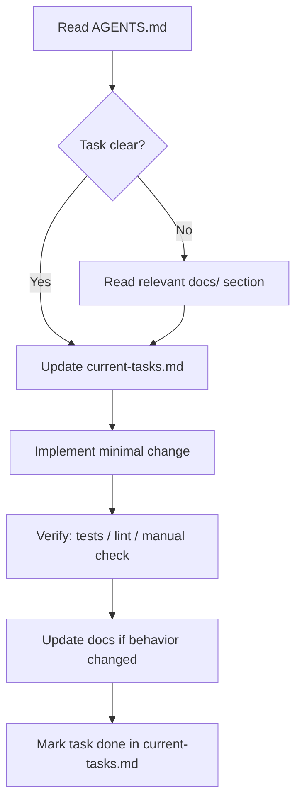

# Agentic workflow

How coding agents should plan, execute, and hand off work in this repo.

## Session flow

## Before coding

1. Read root `AGENTS.md`.
2. Skim [current-tasks.md](current-tasks.md) — avoid duplicating in-progress work.
3. Load task-specific docs only (architecture, security, conventions).
4. If the approach is architectural, draft or reference an ADR first.

## During coding

- **Smallest correct diff** — no drive-by refactors.
- **Follow lockfile** for package manager (`pnpm-lock.yaml` → pnpm, etc.).
- **Parallel tool use** — batch independent file reads and searches.
- **No secrets** in code, logs, or commits.

## After coding

- Run tests and lint when available.
- Update README or `docs/` if setup or behavior changed.
- Move task to **Done** in [current-tasks.md](current-tasks.md) with date and brief note.
- For user-facing features, note manual test steps in the PR body ([pr-checklist.md](pr-checklist.md)).

## Task states

| State | Meaning |
|-------|---------|
| **Backlog** | Not started, prioritized |
| **In progress** | Active agent or human work |
| **Blocked** | Waiting on decision or dependency |
| **Done** | Merged or verified locally |

## When to escalate to the user

- Ambiguous product requirements (tone, platforms, monetization).
- Choice of LLM vendor, cost limits, or data retention policy.
- Breaking API or schema changes without an ADR.
- Security findings that affect production or user data.

## Skills and rules

| Mechanism | Location | When |
|-----------|----------|------|
| Always-on context | `AGENTS.md`, `.cursor/rules/` | Every session |
| Scoped rules | `.cursor/rules/*.mdc` | Matching files / always |
| Project skills | `.cursor/skills/*/SKILL.md` | On-demand workflows |

## Related

- [Task tracking](current-tasks.md)
- [PR checklist](pr-checklist.md)
- [Code conventions](../conventions/code-style.md)
